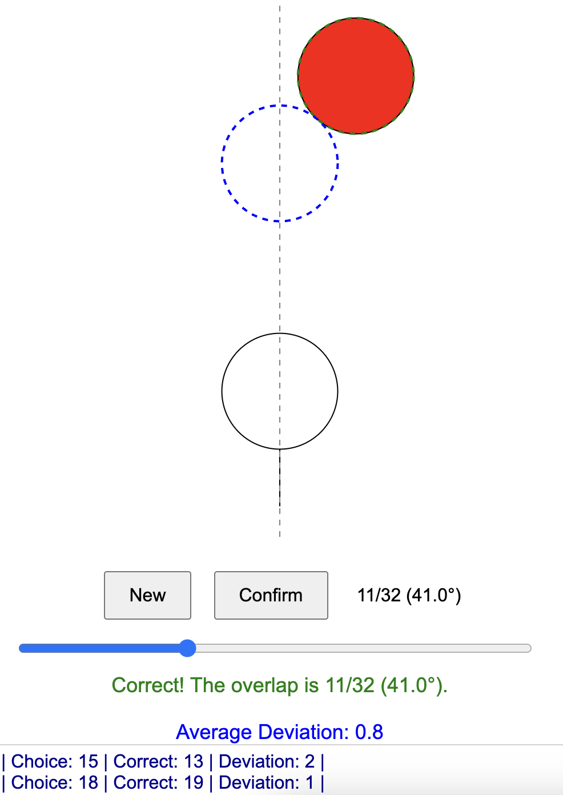

# FractionalAim

## Introduction
It is a training aid for billiards, specifically designed to help users develop an intuition for the cut angle in fractional-ball aiming.

## What is fractional-ball aiming?
- Estimate and obtain a cut angle, then aim using the cut angle.
- An introduction can be found in https://drdavepoolinfo.com//faq/aiming/fractional/

## Accurate ways to calculate cut angle?
- A possible way: https://www.youtube.com/watch?v=4PGSQiq5b9g

## How to practice accurate aiming using the cut angle?
- A possible way is to use FractionalAim.

## How to use FractionalAim?
- It is cross-platform and can be opened on both computers and mobile devices. 
- Simply open the FractionalAim.html file in a browser (such as Chrome or Edge) to use it directly.
